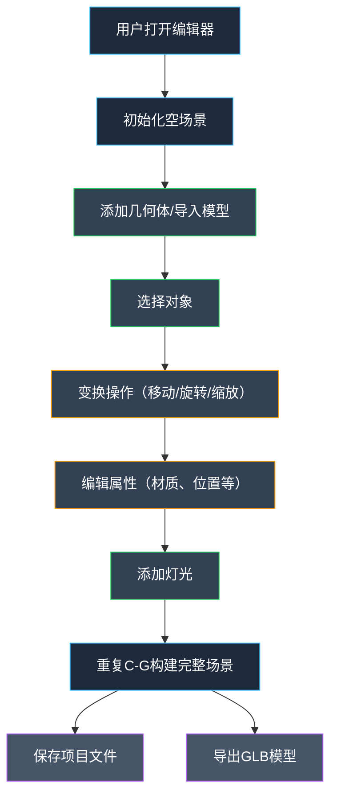

## 1. 产品概述

Web端3D场景与动画编辑器，面向3D设计师、游戏开发者和内容创作者，提供基于浏览器的轻量化3D场景构建、对象编辑和场景导出能力。无需安装大型客户端软件，即可完成从基础几何体搭建到复杂场景导出的完整工作流。

## 2. 核心功能

### 2.1 用户角色

| 角色 | 注册方式 | 核心权限 |
|------|----------|----------|
| 创作者 | 无需注册，直接使用 | 创建场景、编辑对象、导入模型、导出项目 |

### 2.2 功能模块

1. **编辑器主界面**：顶部工具栏、左侧资源库、中央3D视口、右侧属性面板、场景大纲树
2. **场景构建**：基础几何体、模型导入、灯光系统、辅助网格
3. **对象操作**：选择、变换（移动/旋转/缩放）、复制粘贴删除、撤销重做
4. **属性编辑**：变换参数、材质属性、可见性控制
5. **场景导出**：GLB格式导出、项目文件保存与加载

### 2.3 页面详情

| 页面名称 | 模块名称 | 功能描述 |
|----------|----------|----------|
| 编辑器主界面 | 顶部工具栏 | 变换模式切换、几何体添加、灯光添加、导入导出、撤销重做、视图控制 |
| 编辑器主界面 | 左侧资源库 | 模型库分类展示、基础几何体快捷添加、模型导入入口 |
| 编辑器主界面 | 中央3D视口 | Three.js渲染场景、OrbitControls相机控制、TransformControls对象变换、点击/框选 |
| 编辑器主界面 | 右侧属性面板 | 位置/旋转/缩放精确输入、材质属性编辑（颜色、金属度、粗糙度）、可见性开关 |
| 编辑器主界面 | 场景大纲树 | 场景对象层级展示、对象重命名、对象选中同步、可见性快速切换 |

## 3. 核心流程

## 4. 用户界面设计

### 4.1 设计风格

**技术工业风（Tech-Industrial）**

- **主色调**：深空灰 `#0f172a`（背景）、石板灰 `#1e293b`（面板）、冷灰 `#334155`（边框/分隔）
- **强调色**：科技蓝 `#38bdf8`（选中/激活）、琥珀橙 `#f59e0b`（变换操作）、翠绿 `#22c55e`（成功/添加）、品红紫 `#a855f7`（导出/保存）
- **按钮风格**：扁平直角按钮，带细微边框，hover时背景透明度变化，active时轻微内阴影
- **字体**：JetBrains Mono（等宽，用于数值输入）+ Inter（正文，清晰易读）
- **布局风格**：Dock式多面板布局，可拖拽分隔线调整面板宽度，固定工具栏
- **图标风格**：Lucide 线性图标，细线条，1px描边

### 4.2 页面设计概述

| 页面名称 | 模块名称 | UI元素 |
|----------|----------|--------|
| 编辑器主界面 | 顶部工具栏 | 48px高度深色条带，左对齐图标按钮组，中间显示当前场景名称，右侧导出按钮 |
| 编辑器主界面 | 左侧资源库 | 280px固定宽度，顶部Tab切换（模型库/大纲树），内部滚动列表 |
| 编辑器主界面 | 中央3D视口 | 占满剩余空间，黑色渲染区域，左上角视图提示，右下角坐标轴指示器 |
| 编辑器主界面 | 右侧属性面板 | 320px固定宽度，分区折叠面板，数值输入框带步进器，颜色选择器 |
| 编辑器主界面 | 场景大纲树 | 树形结构，缩进显示层级，每行含可见性图标、名称、选中高亮 |

### 4.3 响应式

- **桌面端优先**：设计目标分辨率 1920x1080，适配 1440x900 及以上
- **面板可调整**：左侧和右侧面板宽度可通过拖拽分隔线调整（240px - 400px）
- **触摸优化**：3D视口支持触控旋转、双指缩放
- **不支持移动端**：本产品为桌面端专业工具，不做小屏幕适配

### 4.4 3D场景指导

- **环境/HDRI**：默认使用中性灰色渐变环境，可切换为Studio环境光贴图
- **灯光设置**：默认包含环境光（强度0.5）+ 平行光（强度1.0，45°角投射）+ 半球光
- **相机设置**：PerspectiveCamera，fov=50，近裁剪面0.1，远裁剪面1000，初始位置(5, 5, 5)看向原点
- **相机运动**：OrbitControls，启用阻尼，阻尼系数0.05，最大极角85°
- **构图与焦点**：中心原点为场景焦点，网格地面辅助定位，坐标轴颜色区分（X红/Y绿/Z蓝）
- **交互与动画**：TransformControls绑定选中对象，G键平移/R键旋转/S键缩放切换，Delete键删除
- **后处理效果**：默认启用ACES色调映射、sRGB颜色空间，可选开启抗锯齿
- **资源来源**：内置几何体程序化生成，导入模型支持GLTF/GLB/OBJ/FBX，使用Three.js官方加载器
- **性能预算**：场景对象数量建议<1000，三角面数<50万，保持60fps渲染帧率
