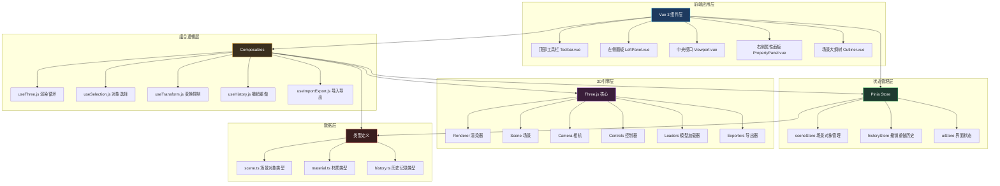
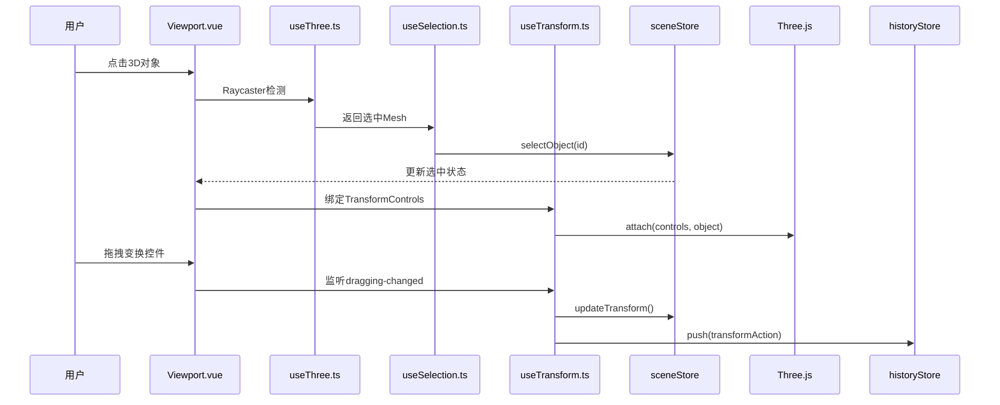
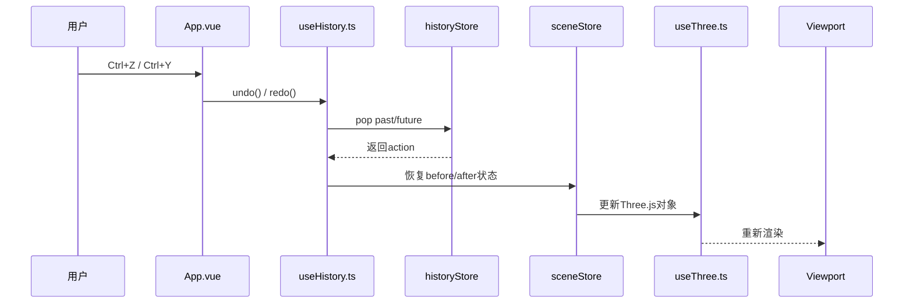

## 1. 架构设计



## 2. 技术描述

### 2.1 核心技术栈

| 类别 | 技术选型 | 版本 | 用途 |
|------|----------|------|------|
| 前端框架 | Vue | ^3.4.0 | 响应式UI框架，使用Composition API |
| 构建工具 | Vite | ^5.0.0 | 快速开发构建，支持HMR |
| 类型系统 | TypeScript | ^5.3.0 | 类型安全，提升可维护性 |
| 3D引擎 | Three.js | ^0.160.0 | WebGL 3D渲染核心 |
| 状态管理 | Pinia | ^2.1.7 | Vue官方状态管理，支持DevTools |
| CSS框架 | Tailwind CSS | ^3.4.0 | 原子化CSS，快速构建UI |
| 图标库 | Lucide Vue | ^0.294.0 | 统一风格的线性图标 |
| 模型加载 | three/addons | ^0.160.0 | GLTF/GLB/OBJ/FBX加载器 |
| 模型导出 | three/addons | ^0.160.0 | GLTFExporter导出GLB |

### 2.2 项目初始化

- **初始化命令**（macOS）：`npm init vite-init@latest -y . -- --template vue-ts --force`
- **开发端口**：53023（在 `vite.config.ts` 中配置 `server.port`）
- **包管理器**：npm

## 3. 目录结构

```
src/
├── components/              # Vue组件
│   ├── editor/             # 编辑器核心组件
│   │   ├── Toolbar.vue     # 顶部工具栏
│   │   ├── LeftPanel.vue   # 左侧资源库/大纲树
│   │   ├── Viewport.vue    # 中央3D视口
│   │   ├── PropertyPanel.vue # 右侧属性面板
│   │   └── Outliner.vue    # 场景大纲树
│   ├── panels/             # 面板子组件
│   │   ├── GeometryLibrary.vue # 几何体库
│   │   ├── LightLibrary.vue    # 灯光库
│   │   ├── ModelImporter.vue   # 模型导入
│   │   ├── TransformSection.vue # 变换属性
│   │   ├── MaterialSection.vue  # 材质属性
│   │   └── ObjectSection.vue    # 对象基础属性
│   └── common/             # 通用组件
│       ├── NumberInput.vue # 数值输入框（带步进）
│       ├── ColorPicker.vue # 颜色选择器
│       └── IconButton.vue  # 图标按钮
├── composables/            # Vue组合式函数
│   ├── useThree.ts         # Three.js核心渲染
│   ├── useSelection.ts     # 对象选择逻辑
│   ├── useTransform.ts     # 变换控制逻辑
│   ├── useHistory.ts       # 撤销重做历史
│   └── useImportExport.ts  # 导入导出逻辑
├── stores/                 # Pinia状态管理
│   ├── sceneStore.ts       # 场景对象状态
│   ├── historyStore.ts     # 历史记录状态
│   └── uiStore.ts          # 界面状态
├── types/                  # TypeScript类型定义
│   ├── scene.ts            # 场景对象类型
│   ├── material.ts         # 材质类型
│   └── history.ts          # 历史记录类型
├── utils/                  # 工具函数
│   ├── threeHelpers.ts     # Three.js辅助函数
│   ├── geometryFactory.ts  # 几何体工厂
│   └── lightFactory.ts     # 灯光工厂
├── App.vue                 # 根组件
├── main.ts                 # 入口文件
└── style.css               # 全局样式
```

## 4. 核心数据模型

### 4.1 场景对象类型

```typescript
// types/scene.ts
export interface SceneObject {
  id: string;
  name: string;
  type: 'mesh' | 'light' | 'group' | 'model';
  visible: boolean;
  locked: boolean;
  parentId: string | null;
  childrenIds: string[];
  transform: Transform;
  material?: MaterialProps;
  geometry?: GeometryProps;
  light?: LightProps;
  threeObject?: THREE.Object3D;
}

export interface Transform {
  position: { x: number; y: number; z: number };
  rotation: { x: number; y: number; z: number };
  scale: { x: number; y: number; z: number };
}

export interface MaterialProps {
  type: 'standard' | 'basic' | 'physical';
  color: string;
  metalness: number;
  roughness: number;
  opacity: number;
  transparent: boolean;
}

export type LightType = 'ambient' | 'directional' | 'point' | 'spot';

export interface LightProps {
  lightType: LightType;
  color: string;
  intensity: number;
  distance?: number;
  angle?: number;
  penumbra?: number;
  castShadow: boolean;
}
```

### 4.2 历史记录类型

```typescript
// types/history.ts
export interface HistoryAction {
  id: string;
  type: 'add' | 'remove' | 'update' | 'transform' | 'paste';
  timestamp: number;
  label: string;
  before: any;
  after: any;
  objectIds: string[];
}
```

## 5. 状态管理设计

### 5.1 sceneStore

```typescript
// stores/sceneStore.ts
- state:
  - objects: Map<string, SceneObject>
  - selectedIds: string[]
  - rootObjectId: string
  
- actions:
  - addObject(obj: SceneObject): void
  - removeObject(id: string): void
  - updateObject(id: string, updates: Partial<SceneObject>): void
  - selectObject(id: string, multi?: boolean): void
  - deselectObject(id: string): void
  - clearSelection(): void
  - duplicateObject(id: string): SceneObject
  - updateTransform(id: string, transform: Partial<Transform>): void
```

### 5.2 historyStore

```typescript
// stores/historyStore.ts
- state:
  - past: HistoryAction[]
  - future: HistoryAction[]
  - maxHistory: number = 50
  
- actions:
  - push(action: HistoryAction): void
  - undo(): HistoryAction | null
  - redo(): HistoryAction | null
  - canUndo(): boolean
  - canRedo(): boolean
  - clear(): void
```

## 6. 核心交互流程

### 6.1 对象选择与变换



### 6.2 撤销重做



## 7. 快捷键定义

| 快捷键 | 功能 |
|--------|------|
| G | 切换到平移模式 |
| R | 切换到旋转模式 |
| S | 切换到缩放模式 |
| W | 切换到平移模式（备选） |
| E | 切换到旋转模式（备选） |
| Delete / Backspace | 删除选中对象 |
| Ctrl+D / Cmd+D | 复制选中对象 |
| Ctrl+C / Cmd+C | 复制对象到剪贴板 |
| Ctrl+V / Cmd+V | 粘贴对象 |
| Ctrl+Z / Cmd+Z | 撤销 |
| Ctrl+Y / Cmd+Y | 重做 |
| Ctrl+A / Cmd+A | 全选 |
| Escape | 取消选择 |
| F | 聚焦选中对象 |
| 1/2/3/4 | 切换视图（透视/前/顶/右） |

## 8. 关键技术点

### 8.1 Three.js 与 Vue 集成
- 使用 `onMounted` 初始化 Three.js 场景、相机、渲染器
- 使用 `requestAnimationFrame` 创建独立渲染循环，不依赖 Vue 响应式
- `TransformControls` 与 `OrbitControls` 协同：变换时禁用轨道控制器

### 8.2 对象同步策略
- Pinia 存储 SceneObject 元数据（id, name, transform 等）
- Three.js Object3D 通过 `userData.id` 与 Store 关联
- Store 更新时通过 `watchEffect` 同步到 Three.js 对象

### 8.3 撤销重做实现
- Command 模式：每个可撤销操作封装为 HistoryAction
- 快照对比：操作前后保存对象状态快照
- 限制历史记录数量，避免内存溢出

### 8.4 性能优化
- 射线检测（Raycaster）仅在鼠标点击时执行
- 使用 `instancedMesh` 优化大量重复几何体
- 渲染循环中使用 `setAnimationLoop` 而非递归 `requestAnimationFrame`
- 材质和几何体复用，避免重复创建
